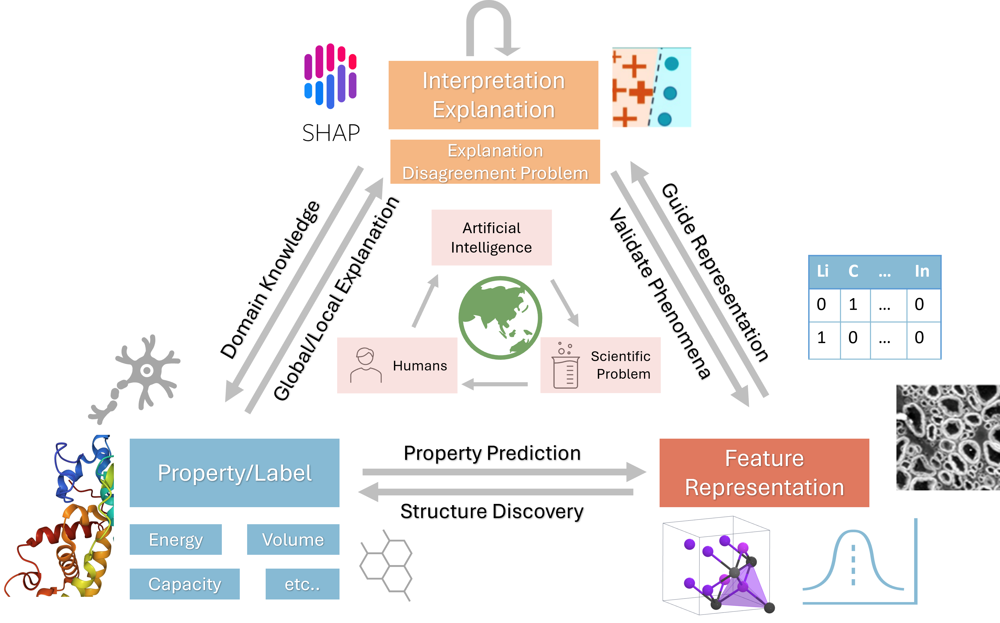

Hi there! My name is Sichao, a Postdoctoral Fellow at Australian National University(ANU), supervised by Dr. Michael McCullough. I have been fortunate enough to be supervised by [Prof. Amanda Barnard](https://en.wikipedia.org/wiki/Amanda_Barnard) and co-supervised by [Dr. Quanling Deng](https://quanlingdeng.github.io/) and [Dr. Amanda Parker](https://comp.anu.edu.au/people/amanda-parker/). I obtained my M.C.S. from ANU in 2020, under the supervision of [Dr. Charles Martain](https://charlesmartin.au/) and I was working as a research assistant under the supervision of [Prof. Steve Blackburn](https://users.cecs.anu.edu.au/~steveb/). I will always be in the fond memory of our dear supervisor -- [Dr. Yu Lin](https://www.forevermissed.com/yulin/about) (1981/11 - 2022/10).

Research Interest and Philosophy
======
My research focuses on eXplainable Artificial Intelligence (XAI) and AI for science. I am driven by the belief that AI and ML can be powerful tools for solving real-world scientific challenges, ultimately contributing to the betterment of society. I utilize ML and XAI advancement to help scientists speed up property prediction, understand the mechanisms underlying machine learning model decisions, and potentially discover new materials. I aim to develop a general interactive interface for researchers to integrate domain knowledge into the model selection process to identify trustworthy, fair,  and faithful ML models. Various domains can benefit from the framework, including biology, chemistry, drug discovery, and materials science. 

*I am currently seeking postdoctoral research opportunities. If you're interested in my work, I welcome discussions about potential collaborations – please feel free to reach out via email.* :relaxed:

News
======
- 2024.05.22: I am pleased to be selected for the best reviewer award from AISTATS 2025.
- 2025.04.10: Congrats to Xin on the acceptance of "Regional Explanations and Diverse Molecular Representations in Cheminformatics: A Comparative Study" from Intelligent Computing.
- 2025.01.29: I am excited to work with Dr. Michael McCullough on understanding patterns of neural connectivity as a Jubilee Joint Associate (Postdoctoral Fellow).
- 2024.12.19: I am delighted to be accredited Fellowship of the Higher Education Academy (FHEA) through ANU Educational Fellowship Scheme (EFS).
- 2024.12.05: Successfully defended my thesis "Design-Driven Materials Intelligence: Bridging AI, Explainability, and Scientific Discovery" in AI, ML, and Friends Seminars at ANU. Congrats to myself!
- 2024.11.06: "EXAGREE: Towards Explanation Agreement in Explainable Machine Learning" is online in arxiv.
- 2024.11.05 "Diverse Explanations From Data-Driven and Domain-Driven Perspectives in the Physical Sciences" is provisionally accepted by Machine Learning: Science and Technology.
- 2024.08.01: "Practical Attribution Guidance for Rashomon Sets" is online in arxiv.
- 2024.05.06: Presented *ICLR 2024* in Vienna, Austria. 
- 2024.02.20: "Multi-Target Neural Network Predictions of Mxenes as High-Capacity Energy Storage Materials in a Rashomon Set" will be presented in SupercomputingAsia 2024, International Convention Centre Sydney, Australia.
- 2024.02.16: "Vice Chancellor’s HDR Travel Grant" is approved.
- 2024.01.17: Our paper "Exploring the cloud of feature interaction scores in a Rashomon set" accepted by *ICLR 2024*
- 2023.12.07: I am pleased to be selected as a "Highlighted Reviewer" of XAIA Neurips 2023.
- 2023.11.09: I am going to visit to teach at Shandong University (Weihai)
- 2023.10.13: Our paper "Multi-Target Neural Network Predictions of Mxenes as High-Capacity Energy Storage Materials in a Rashomon Set" accepted by *Cell Reports Physical Science*
- 2023.06.24: Build the personal webpage, congrats to myself!
- 2023.06.22: Presented (oral) our work in IJCNN 2023, Gold Coast, Australia

Services
====
Conference Reviewer: ICML; Neurips; ICLR; AISTATS; IJCNN; 

Journal Reviewer: Cell Reports Physical Science; Scientific Report; Advanced Theory and Simulations; Materials & Design

Personal hobbies
======
- Ballislife :basketball: is one of my favorites!
- Foodie & cooker: love to try all kinds of food!  
- Gym :runner: is the place to relax after work...
- I also like reading :book: (in philosophy) and playing guitar :guitar: when I am free

